### Hi, I'm DragonAura

- 👀 I’m a PhD student at Tsinghua University
- 🌱 I'm from the Department of Electronic Engineering
- :sparkles: I was the chairman of [eesast](https://github.com/eesast) in 2024-2025

### University

### Languages

|                |                                                                                                                                                                                           Languages                                                                                                                                                                                            |
| :------------: | :--------------------------------------------------------------------------------------------------------------------------------------------------------------------------------------------------------------------------------------------------------------------------------------------------------------------------------------------------------------------------------------------: |
|   Accustomed   |                                                                                                                                                                                      |
| Currently Used |                                                                                                                                                                                                                                                                                          |
|     Others     |  |

### Working with

 

### Operating Systems

